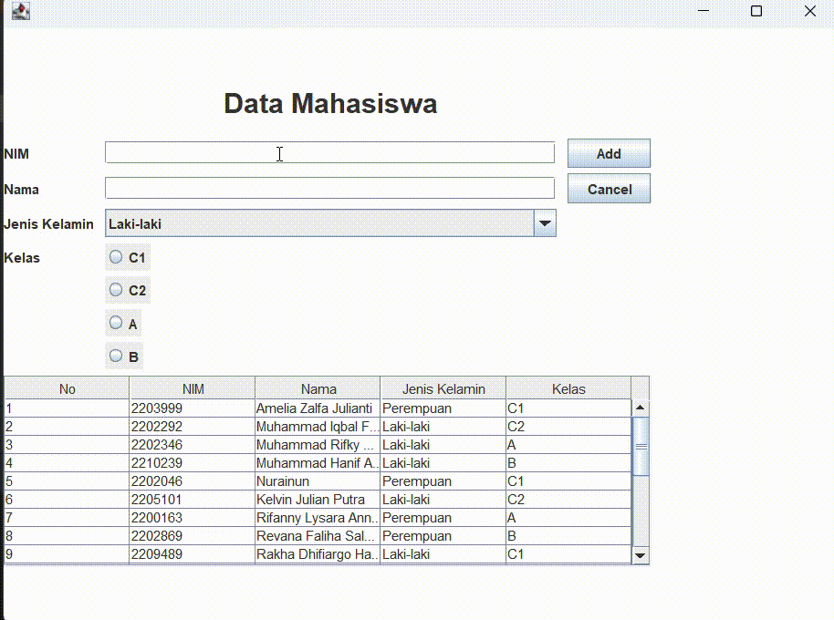

# Tugas Praktikum 4 DPBO 2025 C1
Raffi Adzril Alfaiz - Ilmu Komputer UPI
---

## Janji
Saya, Raffi Adzril Alfaiz dengan NIM 2308355, mengerjakan Tugas Praktikum 4 dalam mata kuliah Desain dan Pemrograman Berorientasi Objek untuk keberkahan-Nya. Maka saya tidak melakukan kecurangan seperti yang telah dispesifikasikan. Aamiin.
---
# Aplikasi Data Mahasiswa - Java Swing

## Deskripsi
Aplikasi ini dibuat menggunakan Java Swing untuk mengelola data mahasiswa berupa **NIM**, **Nama**, **Jenis Kelamin**, dan **Kelas**. Fitur utama mencakup **tambah**, **ubah**, dan **hapus** data yang ditampilkan dalam tabel GUI.

## Desain Program
- **Class `Mahasiswa`**  
  Menyimpan data mahasiswa dengan atribut: `nim`, `nama`, `jenisKelamin`, dan `kelas`.

- **Class `Menu` (extends JFrame)**  
  Komponen utama GUI, mengelola tampilan form input dan tabel, serta menangani logika tambah/edit/hapus.

## Alur Program
1. **Program dimulai dari `main()`**: Membuat dan menampilkan GUI.
2. **Form input diisi** → Klik **Add** untuk menyimpan data ke list dan tabel.
3. Klik data di tabel → Form terisi otomatis → Tombol berubah jadi **Update/Delete**.
4. **Update** untuk mengubah data terpilih.
5. **Delete** untuk menghapus data dari list dan tabel.
6. **Cancel** untuk reset form.

## Fungsi Utama
- `insertData()` → Tambah data baru ke list dan refresh tabel.
- `updateData()` → Edit data mahasiswa berdasarkan baris terpilih.
- `deleteData()` → Hapus data dari list dan tabel.
- `clearForm()` → Kosongkan form input.
- `setTable()` → Menyusun dan menampilkan isi tabel berdasarkan list.
- `populateList()` → Contoh data awal ditambahkan ke list.

## Dokumentasi

